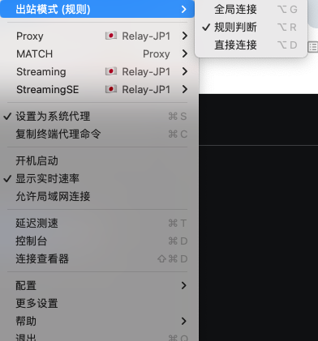
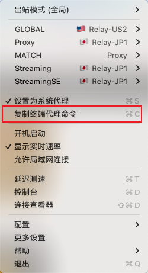
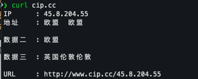
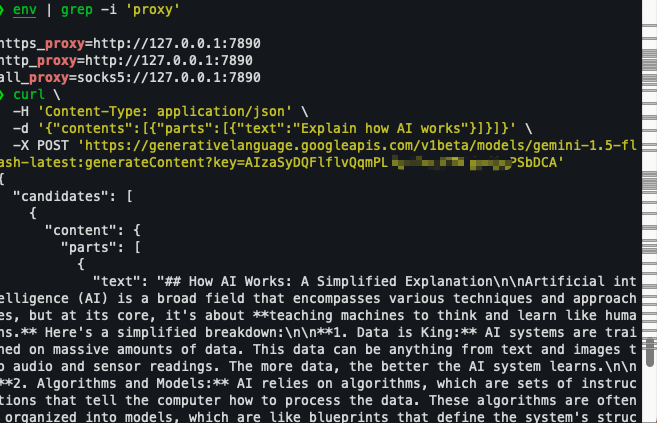

写这篇博客的起因是因为我需要调试谷歌的 AI 接口,如下：

```bash
curl \
  -H 'Content-Type: application/json' \
  -d '{"contents":[{"parts":[{"text":"Explain how AI works"}]}]}' \
  -X POST 'https://generativelanguage.googleapis.com/v1beta/models/gemini-1.5-flash-latest:generateContent?key=YOUR_API_KEY'
```

在 Term2 终端中运行之后返回如下：

```bash
{
  "error": {
    "code": 400,
    "message": "User location is not supported for the API use.",
    "status": "FAILED_PRECONDITION"
  }
}
```

很明显是我的 IP 所属地区被谷歌 AI 限制，因此下一步 意识到需要开梯子

#### 开启 clashX

配置方式如下



因为平时我开梯子就是这种方式。

梯子配置好之后（浏览器可以访问外网），再次在终端运行 curl 命令，返回还是一样，说明终端并没有走代理。

**会不会是出站模式（规则）不是全局连接导致的，改成全局连接，仍然不行**。

查询得知（chatgpt）：

如果在终端请求中没有走 ClashX 代理，但是浏览器请求却走了代理，可能是由于以下几个原因导致的：

1. **代理设置问题**：首先，请确保在终端中的代理设置与浏览器中的代理设置一致。如果在终端中没有正确配置代理，那么终端中的请求将不会走代理。
2. **终端环境变量设置**：在终端中进行网络请求时，有些程序可能会忽略系统代理设置，而是依赖环境变量来确定代理配置。你可以检查终端中是否设置了正确的代理环境变量，例如 `HTTP_PROXY`、`HTTPS_PROXY`、`ALL_PROXY` 等。

总结就是终端没有走系统 clashX 代理，需要手动配置环境变量

#### 手动配置代理环境变量

选择 clashX 中的**复制终端代理命令**，如下图



在终端中运行复制的命令：

```bash
$ export https_proxy=http://127.0.0.1:7890 http_proxy=http://127.0.0.1:7890 all_proxy=socks5://127.0.0.1:7890
```

查看是否配置成功：

```bash
$ env | grep -i 'proxy'
#输出如下表示成功
https_proxy=http://127.0.0.1:7890
http_proxy=http://127.0.0.1:7890
all_proxy=socks5://127.0.0.1:7890
```

好了，检测一下是否 IP 变了，终端运行：

```bash
$  curl cip.cc
```



成功代理！

#### 再次调试谷歌 AI 接口

运行 curl 请求之后，还是不行，什么鬼！哦～原来我是因为开启了两个终端 tab,我设置代理变量和运行 curl 是两个不同环境，

在配置的代理变量窗口运行 curl 之后，谷歌 AI 接口成功返回！！



#### 解决过程知识点汇总

**`export` 和 `unset` 是 Bash（Bourne Again Shell）等 Unix shell 中的命令，用于设置和取消环境变量。**

`export` 命令用于设置环境变量，将一个变量标记为环境变量，使其在当前 shell 进程及其子进程中可用。语法为：

```bash
$ export VARIABLE=value
```

- `VARIABLE` 是环境变量的名称。
- `value` 是要设置的值。

`unset` 命令用于删除环境变量，从而将其从当前 shell 中移除。语法为：

```bash
$ unset VARIABLE
```

配置 `https_proxy` 环境变量**只会**影响通过命令行工具发出的 HTTPS 请求，例如 `curl`、`wget` 等。对于浏览器来说，它们通常不会直接受到 `https_proxy` 的影响。

**curl cip.cc 命令**

表示使用 http 请求访问 cip.cc 网站。返回的结果将显示通过代理链访问 `cip.cc` 时的出口 IP 地址及其相关信息。

示例输出：

假设你的代理链配置有效，运行这个命令后的输出可能是：

```yaml
IP : 203.0.113.1
地址 : 中国 北京
运营商 : 电信
```

#### 参考资料

https://aistudio.google.com/app/apikey?hl=zh-cn 谷歌AI 调试

