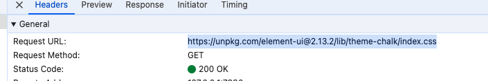

碰到一个需求，需要在内网环境下进行主题切换，本身项目模板使用的是**vue-element-admin**。模板本身是支持主题切换，但是我们看到模板核心代码：`/src/components/ThemePicker/index.vue` 

其中有一段代码:

```vue
if (!this.chalk) {
  const url = `https://unpkg.com/element-ui@${version}/lib/theme-chalk/index.css`
  await this.getCSSString(url, 'chalk')
}
```

很显然，是在切换之后获取在线的 elementUI 主题包，因为网络环境原因，所以要改成**离线**形式

> [!CAUTION]
>
> <u>这里需要注意，在这个模板中，如果使用 --root 变量，色值不可以和切换主题色值相同，因为模块在切换时用算法进行了替换修改，会影响--root 中色值</u>

## 解决办法

1. 根据模板的思想，直接引用这个文件内容。这里有一个点需要注意⚠️
   我一开始是直接引用，

   ```vue
   import themecss from './element-theme/index.css'
   ```

   **结果是错的**。使用 `import themecss from './element-theme/index.css'` 这种方式不会导入一个字符串，而是会将 CSS 文件内容转换为样式并应用到页面上。具体而言，导入的内容并不是直接作为字符串使用，而是通过一系列 Webpack 的 loader（如 `css-loader` 和 `style-loader`）进行处理，将 CSS 样式动态插入到页面的 `<style>` 标签中。

   这里因为限制于模板作者的方法，我们必须要导入一个字符串文本内容（[vue-element-admin在线示例](https://panjiachen.github.io/vue-element-admin/#/dashboard)）：

   

#### **最终方法**

```vue
import themecss from '!!raw-loader!element-ui/lib/theme-chalk/index.css'
```

`!!raw-loader!` 主要用于在 Webpack 中将文件内容作为字符串导入。

[raw-loader](https://www.npmjs.com/package/raw-loader) 包的使用方法很简单，可以参考官方说明

## 解决过程知识点汇总

注意到 `!!raw-loader!` 这种写法其实是一个语法。是因为 Webpack 支持在导入语句中内联指定 loader，这种方式不需要在 **Webpack** 配置文件中预先配置 `raw-loader`，而是通过内联 loader 语法直接在导入路径中指定。

**比如文本文件、HTML 文件、CSS 文件等。**

在 Webpack 中使用 `!!raw-loader!` 语法直接导入文件的内容，是因为 Webpack 支持在导入语句中内联指定 loader。这种方式不需要在 Webpack 配置文件中预先配置 `raw-loader`，而是通过内联 loader 语法直接在导入路径中指定。

### 内联 loader 语法

内联 loader 语法允许你在导入文件时临时指定要使用的 loader。语法格式为：

```
import variable from '!!loader1!loader2!...!path/to/file';
```

### 解释

- `!!`：禁用所有预先在 Webpack 配置文件中为该类型文件定义的 loader，仅使用后面指定的 loader。
- `loader1!loader2!...`：指定要使用的 loader，可以是一个或多个，用 `!` 分隔。
- `path/to/file`：要导入的文件路径。

### 示例

假设你有一个 `example.txt` 文件，其内容如下：

```
Hello, this is an example text file.
```

你可以使用内联 loader 语法直接在 JavaScript 文件中导入这个文本文件的内容：

```javascript
import text from '!!raw-loader!./example.txt';

console.log(text);
// 输出: "Hello, this is an example text file."
```

在这个例子中，`!!raw-loader!` 告诉 Webpack 使用 `raw-loader` 来处理 `example.txt` 文件，并且忽略所有其他配置的 loader。这意味着即使你没有在 Webpack 配置文件中专门为 `.txt` 文件配置 `raw-loader`，它仍然会工作。

### 内联 loader 的优势

- **灵活性**：允许在单个文件中指定 loader，而无需修改整个项目的 Webpack 配置。
- **局部覆盖**：可以临时覆盖全局配置的 loader，适用于特定情况。

### 总结

使用 `import text from '!!raw-loader!./example.txt';` 这种内联 loader 语法，可以在没有预先配置 `raw-loader` 的情况下直接导入文件的内容作为字符串。这种方式提供了极大的灵活性，特别适用于临时需要使用特定 loader 的场景。

在 Webpack 配置文件中已经配置了针对 `.txt` 文件使用 `raw-loader`，并且设置了 `esModule: false` 的选项后，你就不需要在组件中单独使用内联 loader (`!!raw-loader!`) 来导入 `.txt` 文件。你可以直接按照普通的模块导入方式来引入 `.txt` 文件。

### Webpack 配置

```javascript
module.exports = {
  module: {
    rules: [
      {
        test: /\.txt$/i,
        use: [
          {
            loader: 'raw-loader',
            options: {
              esModule: false,
            },
          },
        ],
      },
    ],
  },
}
```

### 组件中导入 `.txt` 文件

假设你有一个名为 `example.txt` 的文件，其内容如下：

```
Hello, this is an example text file.
```

你可以在你的组件中直接这样导入和使用：

```javascript
import text from './example.txt';

console.log(text);
// 输出: "Hello, this is an example text file."
```

### 注意事项

- **`esModule: false` 选项**：设置这个选项是为了确保 `raw-loader` 导入的内容是作为 CommonJS 模块导出的，这样在导入时你可以直接得到文件内容作为字符串。
- **不再需要内联 loader**：因为在 Webpack 配置文件中已经定义了针对 `.txt` 文件的处理方式，所以你不需要在导入路径中指定内联 loader。

### 示例

假设你的项目结构如下：

```
/project
  /src
    /components
      MyComponent.js
    example.txt
  webpack.config.js
```

在 `MyComponent.js` 中：

```javascript
import React from 'react';
import text from '../example.txt';

const MyComponent = () => {
  return (
    <div>
      <h1>Content of example.txt:</h1>
      <pre>{text}</pre>
    </div>
  );
};

export default MyComponent;
```

通过这种方式，你可以确保在组件中轻松导入并使用 `.txt` 文件的内容，而无需在导入路径中使用内联 loader。这样，代码会更加简洁和易于维护。

### Webpack 处理文件路径的方式如下：

1. 首先，Webpack 会解析 import 或 require 语句中的路径。在你的例子中，路径是 'element-ui/lib/theme-chalk/index.css'。
2. 解析路径时，Webpack 会首先检查路径是否是相对路径（以 ./ 或 ../ 开头）或绝对路径（以 / 开头）。如果是，Webpack 会直接使用这个路径。
3. **如果路径不是相对或绝对路径**，Webpack 会认为这是一个模块名，并在 node_modules 目录下查找这个模块。在你的例子中，模块名是 'element-ui'，所以 Webpack 会在 node_modules/element-ui 下查找。
