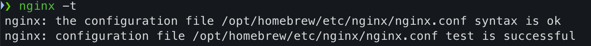
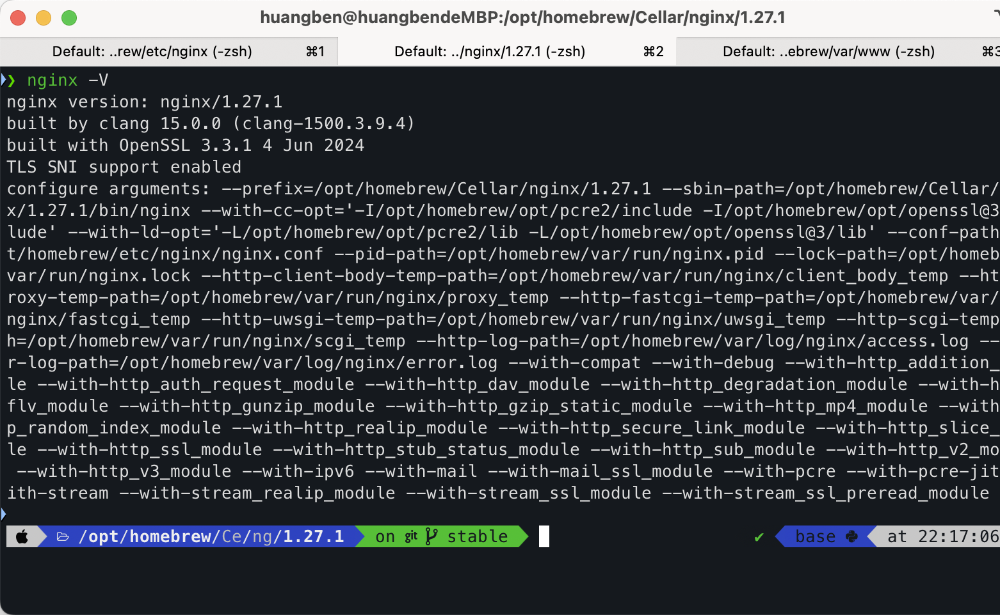
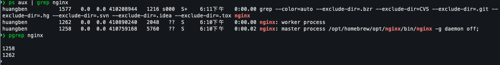
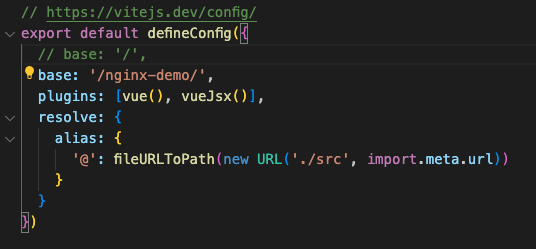
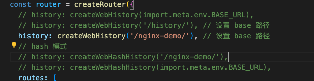

### 前提

当前操作是 MAC M2环境

使用的是 Homebrew 安装 Ngnix 

### 安装 Nginx

```
brew install nginx
```

### 确定 Nginx 位置

 你可以运行以下命令，它不仅**会测试 Nginx 配置文件的语法**，还会显示 `nginx.conf` 文件的路径：

```
nginx -t
```



当**每次修改了Nginx配置 文件**`nginx.conf`，养成习惯，先执行一下`nginx -t`命令，确保配置文件正常

下面是我 Mac M2 通过 **Homebrew** 安装的 nginx 目录结构

```
/opt/homebrew/                # Homebrew 安装根目录
├── Cellar/
│   └── nginx/
│       └── 1.27.1/           # Nginx 版本目录
│           ├── bin/               # 包含 nginx 可执行文件
│           ├── homebrew.nginx.service   # 是一个系统服务单元文件，用于管理通过 Homebrew 安装的 Nginx 服务
│           ├── html -> ./../../var/www  # 软链接，指向文档根目录
│           ├── LICENSE
│           ├── ...
└── etc/
│    └── nginx/                  # Nginx 默认的文档根目录
│        ├── nginx.conf          # Nginx 主配置文件
│       └── ...                  # 其他静态文件
└── var      # 软链接指向的位置
     └── www/            # Nginx 服务提供网页内容的地方
          ├──index.html # Nginx 默认的主页文件
          ├── 404.html   # Nginx 错误时看到的消息 
          
```


### 为什么特意强调目录结构

因为最开始**习惯性的代入了 Linux 中 nginx 安装结构**，毕竟新手会去找相关配置文件，包括网页存放的内容信息，容易搞蒙，单独把这个强调一下

### 重点关注

- 配置文件 **nginx.conf**
- 网页内容 **www**

在绕了一下nginx 文件位置之后，其实我们在使用 nginx 时不用特意关心他们在不同操作系统具体位置在哪里，可以直接使用命令去看

```
nginx -V # 这里“v"是大写，会全面的 nginx 各个配置位置信息，因为小写v 是查看当前 nginx 的版本号
```



### 启动 Nginx

```
brew services start nginx
```

### 访问启动的服务器

一般是http://localhost:8080/，可以看到成功页面提示，如果不是，去查看nginx.conf 中监听的是哪一个端口

### 停止 Nginx

```
brew services stop nginx
```

### 重启 Nginx

```
brew services restart nginx
```

### 判断是否正常启动

```
ps aux | grep nginx
```

或者

```
pgrep nginx   
```

`pgrep` 只返回匹配的进程 ID，不会列出 `grep` 自身。

如图：



在运行 `ps aux | grep nginx` 后看到三个 Nginx 进程是正常的，这与 Nginx 的工作原理有关。

### 为什么会有三个 Nginx 进程？

1. **Master 进程**: 这个进程负责控制和管理 Nginx 实例，是所有 worker 进程的父进程。
2. **Worker 进程**: 默认情况下，Nginx 可能配置为启动两个 worker 进程（或更多），它们用于处理实际的客户端请求。
3. **第一个进程ID如图为 1577**：这个输出表示你运行 `ps aux | grep nginx` 命令时，`grep nginx` 自身作为一个进程被列出在了进程列表中

有了进程，因此可以进程停止 Nginx

```
ps aux | grep nginx
kill -QUIT <PID>
```

将 `<PID>` 替换为 Nginx 进程的 ID。

### 配置 Nginx

**重点强调**！！！

**养好备份习惯，去哪个服务器改配置，先备份文件，再创建新的文件来改**

简单来说nginx.conf 就是 nginx 主配置文件，可能还有 nginx.conf.default 文件，这些都不重要，

**如何去理解主次配置文件呢？**

nginx.conf 是全局配置文件，因此通常我们会在当前目录下面建立一个 conf.d 等名称的目录，用来存放 nginx 其他局部配置文件：

```shell
└── etc/
│    └── nginx/                  # Nginx 默认的文档根目录
│        ├── nginx.conf          # Nginx 主配置文件
         ├── conf.d/             # 局部 配置文件目录
               ├── project1.conf # 项目1 的配置文件
               ├── project2.conf # 项目2 的配置文件
               ├── ...
```

为什么这样划分呢，这样做的到处就是让配置看起来更清晰，不同项目配置中就配置自己项目的 server

```bash
   server {
        listen 8083;
        server_name vue3-dmeo;
        root /opt/homebrew/var/www/nginx-history-demo/dist/;
        location /history/ {
           try_files $uri $uri/ /index.html;
        }
    }
```

全局 nginx.conf配置一般是下面这种，至于负载均衡等，分流啥的这里先不作补充

```
events{}

http {
    #  这里是全局配置 会被所有的server块继承 也可以在server块中单独配置
    #  这里配置的是文件类型 也就是说nginx会根据文件类型来设置响应头
    #  例如 text/html 会设置Content-Type: text/html
    #  css文件会设置Content-Type: text/css
    include       mime.types;  
    
    # 表示conf.d 目录下的所有.conf结尾的文件都会被加载执行
    # 这样做的好处是可以将配置文件分开管理
    include       /opt/homebrew/etc/nginx/conf.d/*.conf;
}
```

### Nginx 常用 API

- **proxy_pass**  用于将客户端请求代理到另一个服务器或服务

- **upstream**  用于定义一个服务器组，这些服务器将处理来自客户端的请求。通过 `upstream`，你可以配置负载均衡，将请求分发到多个后端服务器，从而提高系统的可扩展性和可靠性

  ```
    # 负载均衡
    # 在 NGINX 的 upstream 配置中，端口后面不能带路径。upstream 指令用于定义一组服务器，
    # 而每个服务器的地址只能包含主机名或 IP 地址和端口号，不能包含 URL 路径。
      upstream nextjs {
          server localhost:3000 weight=5; # 权重
          server localhost:3001 weight=2;
      }
     server {
          listen 8086;
          server_name localhost;
          root /opt/homebrew/var/www/localhost;
          index  index.html;
          
          # 代理到本地的3000端口
          location / {
              proxy_pass http://nextjs; # 代理到负载均衡 把请求分发到3000和3001 服务器集群
          }
      }
  ```

### 调试技巧

当我们想 **debug** `$uri`  到底是什么，可以这样，增加一个自定义响应首部**add_header**，再用 `curl -i` 命令去调试查看

```bash
 server {
        listen 8083;
        server_name vue3-dmeo;
        root /opt/homebrew/var/www/nginx-history-demo/dist/;
        location /history/ {
        add_header X-debug-uri "$uri";
           try_files $uri $uri/ /index.html;
        }
    }
```


### 学会分析问题

很简单，服务器访问 **404**,**500** 等，直接去看nginx 下面的 **error.log** 文件，里面说的很清楚！！！

- **access.log**：记录每个请求的详细信息，用于监控和分析访问流量。
- **error.log**：记录服务器遇到的错误和异常信息，用于故障排查和问题解决。

### 与前端 SPA 项目部署的关系

- 部署到根目录

​        以 vue3 项目为例，如果需要部署到服务器根目录，没什么好说的，默认打包就行了，不需要改什么配置

- 部署到非根目录

  前端需要修改两处地方，一个是 vite.config.ts 中的 base 属性，一个是路由中的history 属性

  

 



然后非根目录 nginx的配置如下

```
   # 部署到非根目录（如：http://localhost:8081/nginx-demo/）下面
   server {
        listen 8081;
        server_name vue3-dmeo;
        root /opt/homebrew/var/www/nginx-demo/;
        location /nginx-demo/ {
            alias /opt/homebrew/var/www/nginx-demo/dist/;
            try_files $uri $uri/  /nginx-demo/index.html;
        }
    }
```

其实，这里想说的很仔细，但是吧，还是需要自己各人去实践，总结一下需要注意的点，实践试出来的：

- 部署到非根目录时，history 路由模式，base 需要跟 location 一致。

- 如果location 前面名称需要跟前端配置的二级目录不一样，那前端两个配置都不需要改，配置文件改root 相关就行

- 还有就是hash 模式下，如果非根目录部署，则更好处理，原理一样

- 具体还是自己去试吧

  

未完待续。。。。
