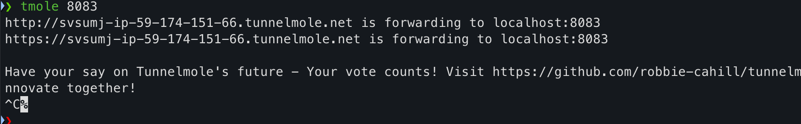

### 介绍

平时本地跑 demo，想给别人看，或者调试，因为不在一个局域网，所以不方便，这个工具就是干这个事的

### 地址

[tunnelmole github](https://github.com/robbie-cahill/tunnelmole-client)

### 安装

我 MAC   M2 

```bash
sudo npm install -g tunnelmole
```

### 使用

使用命令

```bash
tmole 8083
```

效果：



这里 http://svsumj-ip-59-174-151-66.tunnelmole.net  这个地址就是暴露出去的公网地址，映射到自己本地 localhost:8083 地址，你需要暴露哪个端口就是写哪个
