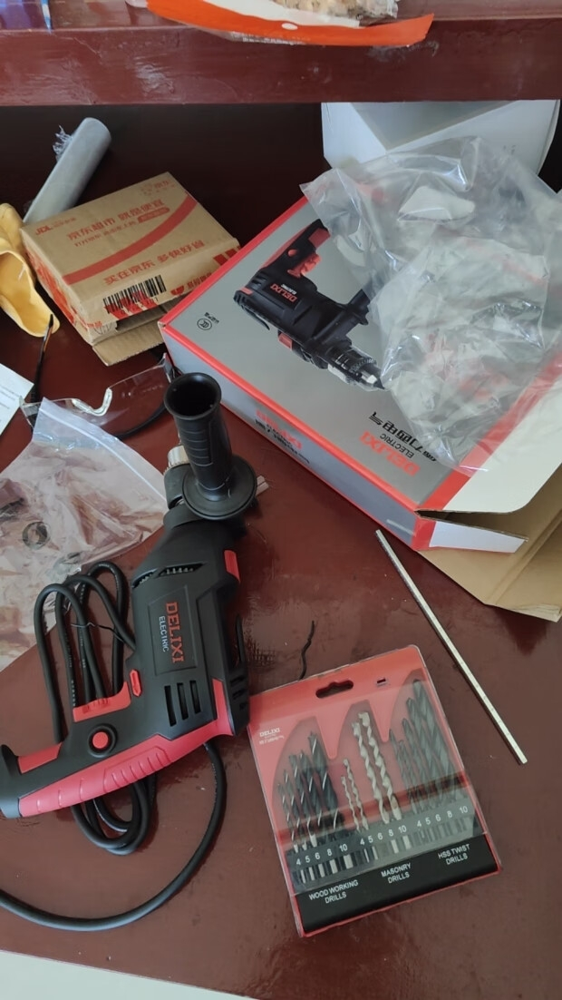

聊一聊关于我自己自学新技术的心得。这里其实说技术不好，应该是技能，技多不压身的技。因为不限于开发语言

## 为什么学

### 工作原因

我自身是一名前端，**工作中的职称**。但是自己作为程序员肯定是不把自己定位于一名前端，因为技术是不分前后端的，一**个产品缺少哪一个环境都不行**。

所以更多的是出于**好奇**，**一探究竟的心态去学习，并没有什么功利心**。比如我去学习 Java，网上都说是 49 年入国军，我不这样认为，如果你是准备入行 Java，并谋取一份工作，那可能是这样吧，但是我自己的工种是前端，我学习Java，更主要的是因为跟我平时联调的都是Java。同样我因为了解大模型，我学了 **Python** 等

在 Java 后端里面，水平高低不齐，因此会存在一些问题，比如数据不严格，**该 nubmer 的不给 number**，问就是不好弄。

**比如服务器报错**，问就是他本地是好的，测试环境不行，其实他这样说是没问题的，毕竟对方本地真的是好的，测试人员并不关心是谁的问题，但是报错在前端，所以会下意识去找前端。
但是这个时候，**我们中间有一个中间商，那就是服务器 nginx 等**，这个时候，水平低的后端估计他也不太懂，毕竟需要懂基础的 Linux 和 nginx 服务器，了解 http协议等相关运维知识。

**所以，与其去争论是谁的问题，不如自己搞懂，找到问题，再去让对应的人去解决，顺带提升了自己的能力。**

### 自身练习

还有一个情况就是，比如我现在想学习前端的文件分段上传，这个时候你想**自己研究一下**，那么问题来了，你是不是需要一个接口，普通的 mock 做不到，而且在**实际的开发中，你真正遇到的还是 Java 写的**，你不可能自学让别人给你写好，这个不可能。

所以求人不如自己动手去实现。

当然这里说的**自学并不是单纯的针对 Java**，例如我上提到的，分析问题，**服务器报错，我需要去学习 niginx**，如果公司项目是部署的 docker，我需要去学习 docker

### 开源工具

还有一种情况就是，比如当我想去了解和运用 **AI 本地大模型**时，例如 **[Ollama](https://ollama.com/)**，他们的运行方式**推荐用 docker**。这个时候如果你不懂他们的命令和机制，你甚至都没法跑起来，所以为了跟上开源最新的技术，还得了解前端之外的技术

## 学习方法

### **从实用出发，抓住重点**

学习一门新技术，最关键的是先从实际操作开始。你得**先搞清楚什么是最重要的，什么是次要的，先掌握关键的，再根据需要去扩展**。这样你就不会被各种细节搞晕，而是有方向地学习。

例如 nginx，你最最重要的是搞清楚它是干嘛的，它在最常用来干嘛，在实际项目中用来干嘛的。

你搞清楚 nginx 配置文件主要的属性就先用，其他的属性再慢慢了解

### **记录实践中的问题，积累经验**

在学习过程中，实**际动手操作是非常重要的**。你在**本地环境**下操作时，肯定会遇到各种问题和错误。作为新手，遇到这些问题时一定要记录下来。这样不仅方便以后查阅，还能积累宝贵的经验，因为这些问题往往是很多人都会遇到的。

有时候你遇到的问题可能超出了当前技术的范围，这时候你要明白，技术之间是互相关联的。如果你发现某个点没搞懂，可能说明你在另一个方面还不够熟悉。不过也不用担心非得全弄明白，只要搞清楚它跟你正在学的技术的关系就行了。这样你就能**慢慢建立起完整的知识体系**。

例如我最开始学习 linux，我其实大学就听网上说这个很重要，但是心里知道重要，书也买了，鸟哥的，基础篇跟服务器篇，视频也看了，但是仍然**记住不操作命令**，实在太多了，并且不知道重点学哪一块。

后来直到工作中，真正遇到问题，比如部署，比如说查看日志，才知道，哦原来这种情况，需要用到 Linux 的这个。

**解决问题的过程去理解知识**，事半功倍，印象深刻，并且有成就感。

并且意识到了，**技术真的不需要去记**，而是了解当前工具是干什么的，要解决什么问题，**工具不重要解决问题的思路更重要**，毕竟工具很多种。每个工具的用法都不一样。

### **教别人是最好的学习方式**

学习和实践之后，**最好能把你的收获写成笔记或博客**。最有效的学习方法之一就是以传授的心态来整理和表达你的知识。这其实是一种叫做“**费曼学习法**”的方法，由著名物理学家理查德·费曼提出来的。费曼认为，要真正理解一个概念，**最好的办法就是试着教别人**。通过这种方式，你能发现自己理解的盲点，并及时补足。

## 故事延伸

前些时我老家有个房间装修了，但是窗帘没装，太阳早上六点多就晒到了床上，那必然影响睡觉。忍不了！

按照以前的学生思维，可能觉得这个不是我干的事，必须找装修师傅，电工，什么工的。找别人安装窗帘的师傅上门一个窗帘，贵了我不想，便宜了师傅不干。

所以，现在自己作为一个快 30 的人了，必须抛弃一个概念，克服心理障碍，抛弃学生思维。当然我语文不行，看懂就行。

- 因此我首先准备好了电钻，在购买之前，我在 [B 站上](https://www.bilibili.com/video/BV1eM4m1m7BC/?spm_id_from=333.999.0.0)了解了冲击钻，钻墙，钻水泥，了解膨胀螺丝等相关知识。
- 测量窗户尺寸，去购买罗马杆窗帘等
- 对比家里其他房间有的窗帘
- 成功安装

最后就是安装**非常成功**，~~其实多钻了一个孔~~~~，中间螺丝反复掉地上，力道太大，生怕钻到了钢筋~~

**后续准备就是了解电工知识，因为要把老家有些老旧插孔插座换掉，自己动手最好，毕竟这些东西是我们生活中常用的，不可能每次一点小问题都找别人，贵不说，而且麻烦。**

## 结尾

以上就是我在自学新技术时的一些体会。学习是一条漫长的路，保持好奇心和不断探索的态度才能学的进去！！！
