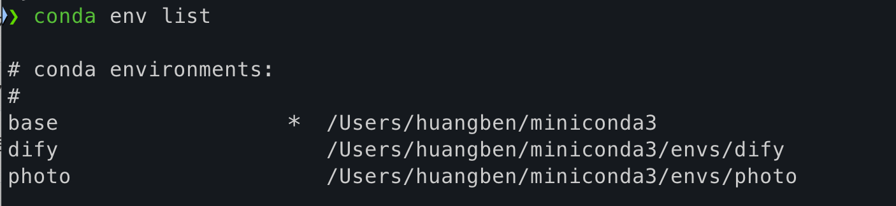

# Conda 虚拟环境管理总结

当前我已经使用 vscode 扩展，很方便的集成了 conda，后续有时间再补一盘 vscode跟虚拟环境相关的

## 1. 创建虚拟环境

要创建一个新的虚拟环境，可以使用以下命令：

```bash
conda create --name myenv python=3.10
```

### 命令说明

- `--name myenv`：指定新环境的名称为 `myenv`，可以根据需要更改名称。
- `python=3.10`：指定要安装的 Python 版本为 3.10（可选）。

### 创建步骤
1. 打开终端。
2. 输入命令并确认。
3. 激活新环境：

   ```bash
   conda activate myenv
   ```

## 2. 删除虚拟环境

要删除一个虚拟环境，可以使用以下命令：

```bash
conda remove --name myenv --all
```

### 删除步骤
1. 打开终端。
2. 输入命令并确认。

## 3. 修改虚拟环境

### 3.1. 修改环境名称
1. 创建新环境：

   ```bash
   conda create --name newenv --clone oldenv
   ```

2. 删除旧环境：

   ```bash
   conda remove --name oldenv --all
   ```

### 3.2. 安装/卸载包
- **安装包**：

   ```bash
   conda install package_name
   ```

- **卸载包**：

   ```bash
   conda remove package_name
   ```

### 3.3. 更新包
- 更新特定包：

   ```bash
   conda update package_name
   ```

- 更新所有包：

   ```bash
   conda update --all
   ```


## 4. 查看虚拟环境

### 4.1. 查看所有虚拟环境

查看系统中所有的 Conda 虚拟环境：

```bash
conda env list
```

或：

```bash
conda info --envs
```

### 4.2. 查看当前激活环境的信息

查看当前激活环境的详细信息：

```bash
conda info
```

### 4.3. 查看当前环境中已安装的包

查看当前激活环境中已安装的所有包：

```bash
conda list
```

### 4.4. 查看特定包的信息

查看特定包的信息：

```bash
conda list package_name
```


## 相关问答

### 可以创建名称相同的环境名称吗

不能创建名称相同的虚拟环境。

如果你尝试创建一个已经存在的环境名称，Conda 会提示你该环境已经存在，并阻止创建相同名称的环境。例如：

```bash
conda create --name myenv python=3.10
```

如果 `myenv` 已经存在，你会看到类似以下的提示：

```
CondaValueError: prefix already exists: /path/to/miniconda3/envs/myenv
```

### 解决方案

如果你需要创建一个类似的环境，可以采取以下方法：

1. **删除旧环境**：如果不再需要旧环境，可以删除它，然后创建新环境。

   ```bash
   conda remove --name myenv --all
   ```

2. **使用不同的环境名称**：创建环境时使用不同的名称。例如：

   ```bash
   conda create --name myenv2 python=3.10
   ```

3. **克隆环境**：如果你想保留相同的依赖配置，可以克隆现有环境，并使用不同名称。

   ```bash
   conda create --name newenv --clone myenv
   ```

**在每个虚拟环境中，只能存在一个版本的 Python。如果需要多个版本的 Python，则可以为每个版本创建独立的虚拟环境，并在项目需要时激活相应的环境。**


##  mac系统 ，使用的是 miniconda3 ，请问依赖在哪里

```
/Users/huangben/miniconda3/envs/photo/lib/python3.10/site-packages
```

photo 就是虚拟环境名称，默认是 `base`



当你**激活一个 Conda 环境**后，在**该环境中**安装的**所有依赖**都会被保存在该环境的**特定目录**中。在这个环境激活期间，你可以在任何项目中直接使用这些已安装的库，而**不需要写**相对路径或绝对路径

### 如何查看依赖

1. **激活环境**：使用以下命令激活你的 Conda 环境：

   ```bash
   conda activate myenv
   ```

2. **查看安装的包**：你可以使用以下命令查看当前环境中安装的所有包：

   ```bash
   pip list
   ```

   或者使用 Conda 的命令：

   ```bash
   conda list
   ```

这样你就可以查看当前环境中的所有依赖以及它们的安装位置。

Conda、Miniconda 和 Anaconda 是用于管理 Python 环境和包的工具和发行版，它们之间有一定的关系和区别。

## Python 虚拟环境工具关系解释

### Conda

- **定义**：Conda 是一个开源的包管理和环境管理系统，可以安装、运行和更新包及其依赖项。
- **功能**：不仅支持 Python，还支持其他编程语言（如 R、Ruby、Lua、Scala、Java、JavaScript、C/C++、FORTRAN）。
- **使用**：可以创建和管理独立的环境，确保不同项目的依赖不冲突。

### Miniconda

- **定义**：Miniconda 是一个轻量级的 Conda 发行版，只包含 Conda 和其依赖的最小系统包。
- **功能**：提供了一个最小化的安装包，用户可以根据需要安装其他包和环境。
- **适用场景**：适合希望从头开始构建自定义 Python 环境的用户。

### Anaconda

- **定义**：Anaconda 是一个包含 Conda 的完整 Python 发行版，预装了大量的科学计算、数据分析和机器学习相关的包。
- **功能**：除了 Conda，还包含了许多常用的包（如 NumPy、Pandas、SciPy、Jupyter Notebook 等）和工具（如 Anaconda Navigator）。
- **适用场景**：适合需要一个开箱即用的科学计算和数据分析环境的用户。

### 关系

- **Conda** 是包管理和环境管理工具。
- **Miniconda** 是一个轻量级的 Conda 发行版，只包含 Conda 和其依赖的最小系统包。
- **Anaconda** 是一个包含 Conda 的完整发行版，预装了大量的科学计算和数据分析相关的包。

### 选择

- **Miniconda**：如果你希望从头开始构建自定义环境，并且只安装你需要的包。
- **Anaconda**：如果你需要一个开箱即用的环境，包含了大多数常用的科学计算和数据分析包。
