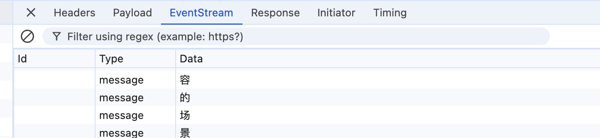

#### **1. 技术栈**

- **后端**：Flask（Python）
- **前端**：Next.js（React）
- **通信方式**：Server-Sent Events (SSE) 流式响应
- **核心工具**：
  - Flask：`Response` + `stream_with_context`
  - Next.js：`fetch` + `ReadableStream`

这篇笔记的起源是，研究前端与服务端进行流式响应，同时研究 SSE 和 AI 聊天相关的内容，综合记录的一个实践笔记。直接说**出踩的坑**，和理解得知识点

####  2. 跨域问题

- 第一步首先就是请求跨域，我在 next.js 服务发起对 py 得本地服务，跨域了，之前也解决过，使用下面这段

  ```python
  # 启用 CORS，允许来自特定来源的跨域请求
  CORS(app, supports_credentials=True, resources={r"/*": {"origins": "*"}})
  ```

  然后 `http://localhost:5000/chat` 跨域，**但是** `http://127.0.0.1:5000/chat` 可以

  最后发现，原来是跟  `host='0.0.0.0'`有关，如果加上使用两种方式都可以

  ```python
  app.run(host='0.0.0.0', port=5004, debug=False)
  ```

  默认情况下，它**Flask**会监听 `127.0.0.1`（本地主机）上的端口 `5004`。
  **`localhost` 和 `127.0.0.1` 的行为差异**：

  - 浏览器将 `localhost` 和 `127.0.0.1` 视为不同的域名，即使它们指向同一台机器。
  - 即使 CORS 配置允许所有来源，浏览器仍然会对 `localhost` 施加额外的安全限制

  如果你希望 Flask 应用程序能够被其他设备访问，你需要将配置参数设置为 `'0.0.0.0'`，这表示监听所有可用的网络接口。

#### 3. SSE的理解

起初我认为SSE是必须使用，毕竟你在 MDN 查询都是这类介绍，但是其实不能**单一**这样去理解

```javascript
const eventSource = new EventSource('/chat');
eventSource.onmessage = (event) => {
console.log(event.data); // 接收服务器发送的数据
};
```

当运行了下面得核心代码之后，会发现，并没有使用**EventSource** 仍然会看到


可以看到，**仍然实现了类似 Server-Sent Events (SSE) 的功能**。

#### 为什么示例仍然是一个 EventStream 连接？

因为满足了某些特定条件，在示例中，我们没有使用 `EventSource`，而是使用了 `fetch` 和 `ReadableStream`。

1. 服务端必须返回 `Content-Type: text/event-stream`。
2. 数据格式必须符合 SSE 规范（`data: <content>\n\n`）。
3. 客户端通过 `fetch` 和 `ReadableStream` 逐块读取数据，并手动解析。

但是，需要注意一个概念问题，原生 SSE，是一个长连接，服务器可以向浏览器推送信息，我们示例只是实现了一个类似的响应式流效果，它**并不是** SSE长连接。
可以看一下 [阮一峰 SSE 教程](https://www.ruanyifeng.com/blog/2017/05/server-sent_events.html)

**对比总结**

| 特性                    | `fetch` + `ReadableStream`                     | `EventSource`          |
| :---------------------- | :--------------------------------------------- | :--------------------- |
| **连接类型**            | 短连接                                         | 长连接                 |
| **通信方向**            | 单向（客户端请求，服务器响应）                 | 单向（服务器推送）     |
| **请求方法**            | 支持 GET、POST 等任意方法                      | 仅支持 GET             |
| **自定义请求头/请求体** | 支持                                           | 不支持                 |
| **数据解析**            | 需要手动解析                                   | 自动解析               |
| **服务器主动推送**      | 不支持                                         | 支持                   |
| **适用场景**            | 需要灵活控制的场景（如 POST 请求、自定义数据） | 简单的单向数据推送场景 |

#### 前后端核心代码

```python
# server.py
import logging
from flask import Flask, Response,request,stream_with_context
import time
from flask_cors import CORS

app = Flask(__name__)
# 启用 CORS，允许来自特定来源的跨域请求
CORS(app, supports_credentials=True, resources={r"/*": {"origins": "*"}})

# 配置日志记录
logging.basicConfig(level=logging.DEBUG)
LONG_RESPONSE = """
这是一个模拟的流式响应示例。我们将逐字逐句地返回一个较长的文本内容。
通过 Server-Sent Events (SSE) 技术，前端可以实时接收并显示这些数据。
这种方式非常适合用于聊天应用、实时日志推送或大模型生成内容的场景。
Flask 和 Next.js 的结合使得前后端分离的开发模式更加高效。
希望这个示例对你有帮助！
"""
@app.route('/chat', methods=['POST'])
def chat():
    def generate():
     # 逐字返回响应内容
        for char in LONG_RESPONSE:
            time.sleep(0.1)  # 模拟延迟，0.1秒返回一个字符
            yield f"data: {char}\n\n"
        yield "data: [END]\n\n"  # 结束标志
    return Response(stream_with_context(generate()), content_type='text/event-stream')
# 启动服务器
if __name__ == "__main__":
      app.run(host='0.0.0.0', port=5004, debug=False)

```

- **流式响应**：使用 `yield` 逐字返回数据，模拟流式效果。
- **SSE 格式**：数据格式为 `data: <content>\n\n`，符合 SSE 规范。
- **结束标志**：通过 `data: [END]\n\n` 标记流结束。

```jsx
// page.tsx
"use client";
import { useState } from "react";

export default function Home() {
  const [message, setMessage] = useState("");
  const [response, setResponse] = useState("");

  const handleSubmit = async (e) => {
    e.preventDefault();
    setResponse("");

    const response = await fetch("http://localhost:5004/chat", {
      method: "POST",
      headers: {
        "Content-Type": "application/json",
      },
      body: JSON.stringify({ message }),
    });

    if (response.body) {
      const reader = response.body.getReader();
      const decoder = new TextDecoder();

      while (true) {
        const { done, value } = await reader.read();
        if (done) break;

        const chunk = decoder.decode(value);
        const lines = chunk.split("\n");
        for (const line of lines) {
          if (line.startsWith("data: ")) {
            const data = line.slice(6).trim();
            if (data === "[END]") {
              return;
            }
            setResponse((prev) => prev + " " + data);
          }
        }
      }
    }
  };

  return (
    <div>
      <h1>Chat App</h1>
      <form onSubmit={handleSubmit}>
        <input
          type="text"
          value={message}
          onChange={(e) => setMessage(e.target.value)}
          placeholder="Type a message"
        />
        <button type="submit">Send</button>
      </form>
      <div>
        <p>Response: {response}</p>
      </div>
    </div>
  );
}

```

- **流式读取**：使用 `fetch` + `ReadableStream` 逐块读取数据。
- **手动解析 SSE**：通过 `split('\n')` 和 `startsWith('data: ')` 解析 SSE 格式数据。
- **状态更新**：使用 React 的 `useState` 实时更新页面内容。
