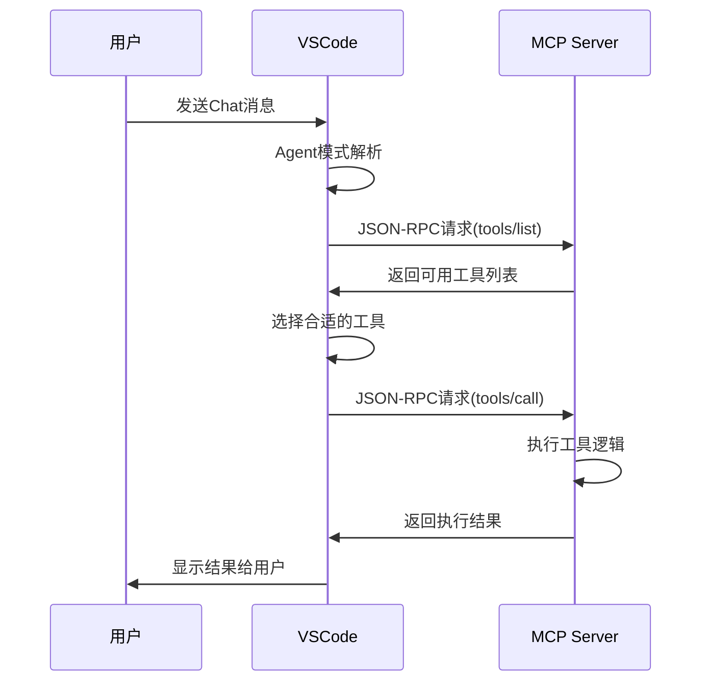

## 什么是 MCP？

**MCP（Model Context Protocol，模型上下文协议）**是一个开放标准协议，允许 AI 模型通过统一接口与外部工具、应用程序和数据源进行交互。简单来说，它是让 AI 助手能够使用各种外部工具的标准化方式。

## MCP 的核心概念

### 三大核心组件

1. **Tools（工具）** - 执行具体操作，如文件操作、数据库查询、API 调用等
2. **Resources（资源）** - 提供上下文信息，如文件内容、数据库记录等（只读）
3. **Prompts（提示）** - 预配置的提示模板，支持参数占位符如 `{{name}}`, `{{location}}`

### 技术优势

- **标准化**：统一的接口规范，确保兼容性
- **安全性**：工具执行需要确认，支持权限控制
- **可扩展性**：支持自定义工具和服务器
- **跨平台**：支持多种传输方式（stdio、SSE、HTTP）

## VSCode 中的 MCP 配置

### 支持版本

VSCode 从 1.102 版本开始正式支持 MCP

### 配置层级

1. **工作区配置**：`.vscode/mcp.json`（项目级别）
2. **用户配置**：`~/Library/Application Support/Code/User/mcp.json`（全局级别）
3. **Dev Container 支持**：容器化开发环境
4. **自动发现**：检测其他工具（如 Claude Desktop）中的 MCP 服务器

### 配置文件示例

以下是一个实际的 MCP 配置文件示例，包含 4 个常用的 MCP 服务：

```json
{
  "inputs": [
    {
      "type": "promptString",
      "id": "figma-token",
      "description": "Figma Personal Access Token",
      "password": true
    }
  ],
  "servers": {
    "github": {
      "type": "http",
      "url": "https://api.githubcopilot.com/mcp/",
      "gallery": true
    },
    "playwright": {
      "type": "stdio",
      "command": "npx",
      "args": ["@playwright/mcp@latest"],
      "gallery": true
    },
    "context7": {
      "type": "stdio",
      "command": "npx",
      "args": ["-y", "@upstash/context7-mcp@latest"],
      "gallery": true
    },
    "Framelink Figma MCP": {
      "type": "stdio",
      "command": "npx",
      "args": ["-y", "figma-developer-mcp", "--figma-api-key=${input:figma-token}", "--stdio"]
    }
  }
}
```

这个配置包含了：

- **GitHub MCP**：GitHub API 集成，使用 HTTP 传输
- **Playwright MCP**：浏览器自动化测试工具
- **Context7 MCP**：文档上下文查询和知识库访问
- **Framelink Figma MCP**：Figma 设计文件访问，需要 API token

## 使用 MCP 服务

### 基本使用流程

1. **启用 Agent 模式**：在 Chat 视图中选择 Agent 模式
2. **选择工具**：点击 Tools 按钮选择要使用的工具（最多 128 个）
3. **执行任务**：输入提示，工具会自动被调用
4. **确认执行**：默认需要确认工具执行（可设置自动确认）

### 高级功能

- **直接引用工具**：在提示中使用 `#工具名` 直接引用
- **工具集管理**：将相关工具分组管理
- **调试支持**：支持 Node.js 和 Python 服务器调试
- **日志查看**：实时查看服务器运行日志

## 实战：MCP 配置管理

### 查找配置文件位置

在 macOS 上，全局 MCP 配置文件位于：

```bash
~/Library/Application Support/Code/User/mcp.json
```

### 从工作区配置迁移到全局配置

**步骤 1：备份现有配置**

```bash
cp ~/Library/Application\ Support/Code/User/mcp.json ~/Library/Application\ Support/Code/User/mcp.json.backup
```

**步骤 2：合并配置**
将工作区级别的 MCP 服务添加到全局配置中，保留原有服务的同时添加新的服务。

**步骤 3：清理工作区配置**

```bash
mv .vscode/mcp.json .vscode/mcp.json.moved-to-global
```

### 配置文件结构说明

```json
{
  "inputs": [
    // 输入变量定义，用于安全地处理敏感信息
    {
      "type": "promptString",
      "id": "figma-token", // 变量ID，在args中引用
      "description": "Figma Personal Access Token", // 用户看到的描述
      "password": true // 隐藏输入内容
    }
  ],
  "servers": {
    "github": {
      // 服务器名称
      "type": "http", // 传输协议：stdio|http|sse
      "url": "https://api.githubcopilot.com/mcp/", // HTTP类型的服务器URL
      "gallery": true // 标识来自官方gallery
    },
    "playwright": {
      "type": "stdio", // 标准输入输出传输
      "command": "npx", // 启动命令
      "args": ["@playwright/mcp@latest"], // 命令参数
      "gallery": true
    },
    "Framelink Figma MCP": {
      "type": "stdio",
      "command": "npx",
      "args": [
        "-y",
        "figma-developer-mcp",
        "--figma-api-key=${input:figma-token}", // 引用输入变量
        "--stdio"
      ]
      // 注意：非gallery服务器不需要gallery字段
    }
  }
}
```

## MCP 底层通信原理深度解析

### 🔌 传输层协议详解

MCP 协议定义了三种传输方式，每种都有不同的底层实现机制：

#### 1. **stdio 传输** - 进程间通信

**什么是 stdio？**

- **stdin**: 标准输入流（文件描述符 0）
- **stdout**: 标准输出流（文件描述符 1）
- **stderr**: 标准错误流（文件描述符 2）

**底层工作原理**：

```bash
# VSCode启动MCP服务器进程
npx -y figma-developer-mcp --stdio

# 通信流程：
VSCode → stdin → MCP Server Process
VSCode ← stdout ← MCP Server Process
```

**实际通信示例**：

```json
// VSCode发送到MCP服务器（通过stdin）
{
  "jsonrpc": "2.0",
  "id": 1,
  "method": "tools/list",
  "params": {}
}

// MCP服务器响应（通过stdout）
{
  "jsonrpc": "2.0",
  "id": 1,
  "result": {
    "tools": [
      {
        "name": "read_figma_file",
        "description": "Read Figma design file"
      }
    ]
  }
}
```

#### 2. **HTTP 传输** - 网络请求

**底层工作原理**：

```bash
# VSCode发送HTTP POST请求
POST https://api.githubcopilot.com/mcp/
Content-Type: application/json

{
  "jsonrpc": "2.0",
  "method": "tools/call",
  "params": {...}
}
```

#### 3. **SSE 传输** - 服务器推送事件

**底层工作原理**：

```bash
# VSCode建立SSE连接
GET https://api.example.com/sse
Accept: text/event-stream

# 服务器推送事件
data: {"jsonrpc":"2.0","method":"notification",...}
```

### 🏗️ VSCode MCP 架构流程

#### 启动流程

1. **配置解析**：VSCode 读取`mcp.json`配置文件
2. **进程启动**：根据`type`选择通信方式
   - `stdio`: 启动子进程 `spawn(command, args)`
   - `http`: 建立 HTTP 客户端连接
   - `sse`: 建立 EventSource 连接

#### 运行时通信



### 🔍 实际代码层面的实现

#### stdio 进程管理

VSCode 内部类似这样的实现：

```typescript
// 启动MCP服务器进程
const mcpProcess = spawn('npx', ['-y', 'figma-developer-mcp', '--stdio'], {
  stdio: ['pipe', 'pipe', 'pipe']
});

// 发送JSON-RPC消息
const request = {
  jsonrpc: '2.0',
  id: generateId(),
  method: 'tools/list',
  params: {}
};

mcpProcess.stdin.write(JSON.stringify(request) + '\n');

// 监听响应
mcpProcess.stdout.on('data', (data) => {
  const response = JSON.parse(data.toString());
  handleMCPResponse(response);
});
```

#### JSON-RPC 协议格式

MCP 使用 JSON-RPC 2.0 作为消息格式：

```json
// 请求格式
{
  "jsonrpc": "2.0",           // 协议版本
  "id": "unique-id",          // 请求ID
  "method": "tools/call",     // 方法名
  "params": {                 // 参数
    "name": "read_file",
    "arguments": {
      "path": "/path/to/file"
    }
  }
}

// 响应格式
{
  "jsonrpc": "2.0",
  "id": "unique-id",          // 对应请求ID
  "result": {                 // 成功结果
    "content": "file content"
  }
}

// 错误响应
{
  "jsonrpc": "2.0",
  "id": "unique-id",
  "error": {                  // 错误信息
    "code": -32602,
    "message": "Invalid params"
  }
}
```

### ⚙️ 环境变量和参数传递

#### 输入变量的处理流程

```typescript
// 1. VSCode解析inputs配置
const inputs = {
  'figma-token': await promptUser('Figma Personal Access Token', true)
};

// 2. 替换args中的变量
const args = [
  '-y',
  'figma-developer-mcp',
  `--figma-api-key=${inputs['figma-token']}`, // 变量替换
  '--stdio'
];

// 3. 启动进程时传递
const process = spawn('npx', args, {
  env: { ...process.env, ...additionalEnv }
});
```

### 🛡️ 安全机制

#### 进程隔离

- 每个 MCP 服务器运行在独立进程中
- 通过 stdio 通道限制通信范围
- 进程权限继承 VSCode 的用户权限

#### 输入验证

- JSON-RPC 消息格式验证
- 参数类型和范围检查
- 工具执行前的用户确认机制

## MCP 生态系统

### 常见 MCP 服务器类型

基于实际使用经验，以下是一些优秀的 MCP 服务器：

- **GitHub MCP Server** - GitHub API 集成，代码仓库管理和操作
- **Playwright MCP Server** - 浏览器自动化测试，网页操作和测试
- **Context7 MCP Server** - 文档上下文查询，技术文档和知识库访问
- **Framelink Figma MCP** - Figma 设计文件访问，设计资源管理
- **文件系统服务器** - 本地文件操作和管理
- **数据库连接服务器** - 数据库查询和操作
- **其他平台服务器** - HubSpot、Unity、Odoo 等专业工具集成

### 开发工具支持

- **MCPTools** - 命令行界面工具
- **MCP-Use** - 连接 LLM 到 MCP 服务器的库
- **各种语言 SDK** - Go、Python、TypeScript、Dart、C#等

## 管理和维护

### 命令行管理

```bash
# 查看已安装的MCP服务器
mcp configs ls

# 添加新的MCP服务器
mcp configs set vscode my-server npm run mcp-server

# 测试MCP服务器
mcp tools npx -y @modelcontextprotocol/server-filesystem ~
```

### VSCode 命令

- `MCP: Open User Configuration` - 打开全局配置文件
- `MCP: List Servers` - 查看已安装服务器
- `MCP: Add Server` - 添加新服务器
- `MCP: Show Installed Servers` - 管理已安装服务器

## 调试和监控 MCP 通信

### 📊 查看通信日志

#### 1. **VSCode 输出面板**

```bash
# 查看MCP服务器日志
View → Output → 选择MCP Server输出
```

#### 2. **stdio 调试模式**

```json
{
  "servers": {
    "debug-server": {
      "type": "stdio",
      "command": "npx",
      "args": ["-y", "mcp-server", "--debug"],
      "dev": {
        "debug": { "type": "node" },
        "watch": "**/*.js"
      }
    }
  }
}
```

### 🔧 常见通信问题排查

#### stdio 进程问题

```bash
# 检查进程是否正常启动
ps aux | grep "figma-developer-mcp"

# 手动测试MCP服务器
echo '{"jsonrpc":"2.0","id":1,"method":"initialize","params":{}}' | npx -y figma-developer-mcp --stdio
```

#### JSON-RPC 通信错误

```json
// 常见错误类型
{
  "error": {
    "code": -32700, // 解析错误：无效JSON
    "code": -32600, // 无效请求：不符合JSON-RPC格式
    "code": -32601, // 方法未找到
    "code": -32602, // 无效参数
    "code": -32603 // 内部错误
  }
}
```

### 🔍 实时监控工具

#### 使用 MCPTools 调试

```bash
# 安装MCPTools
brew install f/mcptools/mcp

# 测试连接
mcp tools npx -y figma-developer-mcp --stdio

# 查看详细日志
mcp tools --server-logs npx -y figma-developer-mcp --stdio
```

#### 进程监控

```bash
# 监控stdio通信（macOS）
sudo dtruss -p $(pgrep figma-developer-mcp) 2>&1 | grep -E "(read|write)"

# 查看文件描述符
lsof -p $(pgrep figma-developer-mcp)
```

## 最佳实践

### 安全性考虑

1. **敏感信息处理**：使用`inputs`字段定义敏感变量，避免硬编码
2. **工具权限控制**：默认启用工具执行确认
3. **服务器来源**：只添加来自可信来源的 MCP 服务器

### 性能优化

1. **工具数量限制**：单次对话最多启用 128 个工具
2. **按需启用**：根据任务需要选择性启用工具
3. **工具集管理**：将相关工具组织成工具集

### 团队协作

1. **工作区配置**：项目特定的 MCP 服务放在`.vscode/mcp.json`
2. **全局配置**：通用工具配置为全局服务
3. **Settings Sync**：启用设置同步保持团队一致性

## 总结

MCP 协议为 AI 辅助开发带来了革命性的变化，让 AI 从简单的对话工具进化为能够执行实际任务的智能代理。通过合理配置和管理 MCP 服务，开发者可以：

- 让 AI 助手访问文件系统、数据库、API 等外部资源
- 执行复杂的开发任务，如代码分析、文档生成、项目管理
- 通过简单配置文件管理各种工具和服务
- 在团队中共享工具配置，提高协作效率

随着 MCP 生态的不断发展，未来会有更多工具和服务支持这个协议，形成一个强大的 AI 工具生态系统。

---

_本文基于 VSCode 1.102+版本和 MCP 协议最新标准编写，配置路径以 macOS 为例。_
